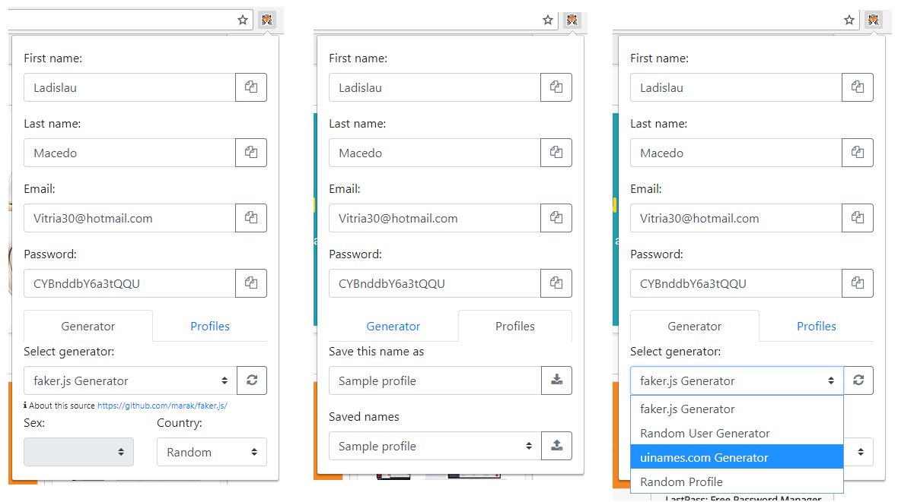

#  Fake name generation extension for Google Chrome

[Name Generator is available in the Chrome Web Store!](https://chrome.google.com/webstore/detail/name-generator/ldkklmldmddiahpjfablcmabdfhodpbi)

Easy way to generate fake names and save them for later use.

## Supported generators

- [Faker.js](https://github.com/marak/Faker.js/)
- [Random User Generator](https://randomuser.me/)
- [Random Profile](http://randomprofile.com/)
- [uinames.com](https://uinames.com/)

## Screenshots

## Installation

 1. Build extension

        npm install
        npm run build
    
 1. In your browser load unpacked extension from `dist` folder

## Release notes

### 0.1.2

 - Fix vulnerabilities by updating dependencies

### 0.1.1

 - Fix vulnerabilities by updating dependencies

### 0.1.0

 - Add auto-refresh on first run
 - Add Faker.js generator
 - Add copy buttons
 - Fix permissions
 - Update dependencies versions, design and icons

### 0.0.0.3
 
 - Add refresh on sex and country change
 - Add Random Profile and uinames.com generators
 - Disable saved name selection when no available

### 0.0.0.2

 - Add error handling for API calls
 - Add persisting last form state
 - Fix profile saving after manual changing form fields
 - Replace buttons text with icons

### 0.0.0.1

 - Initial release
 